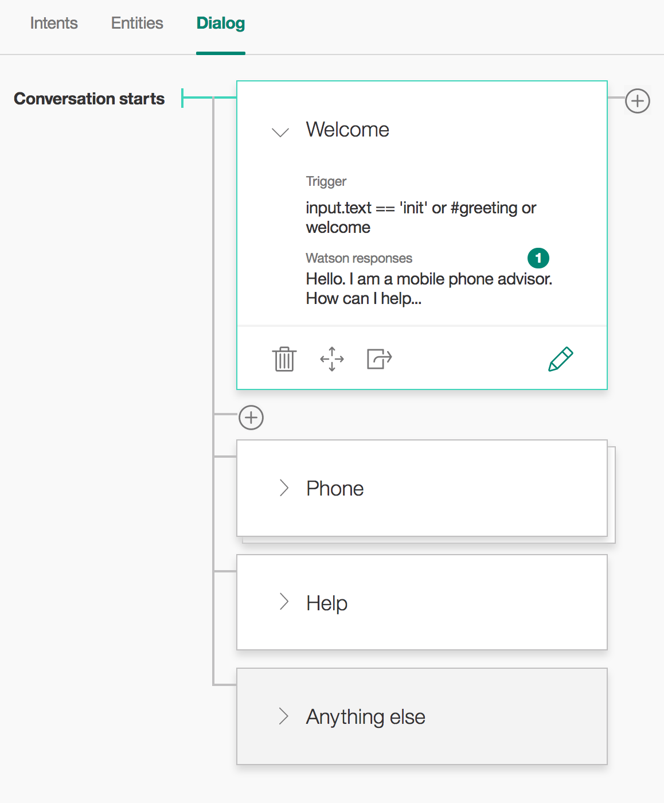
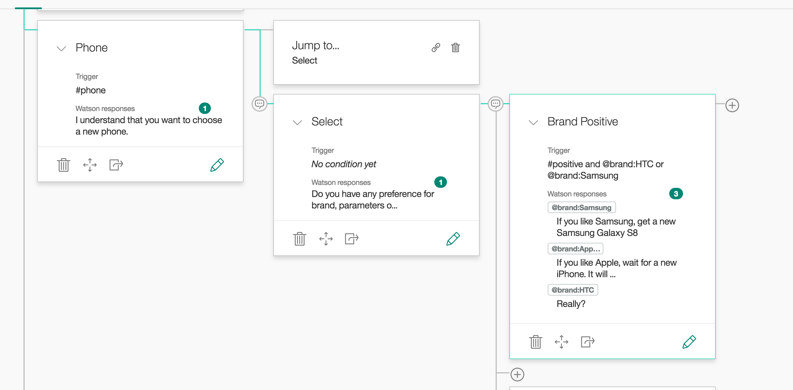
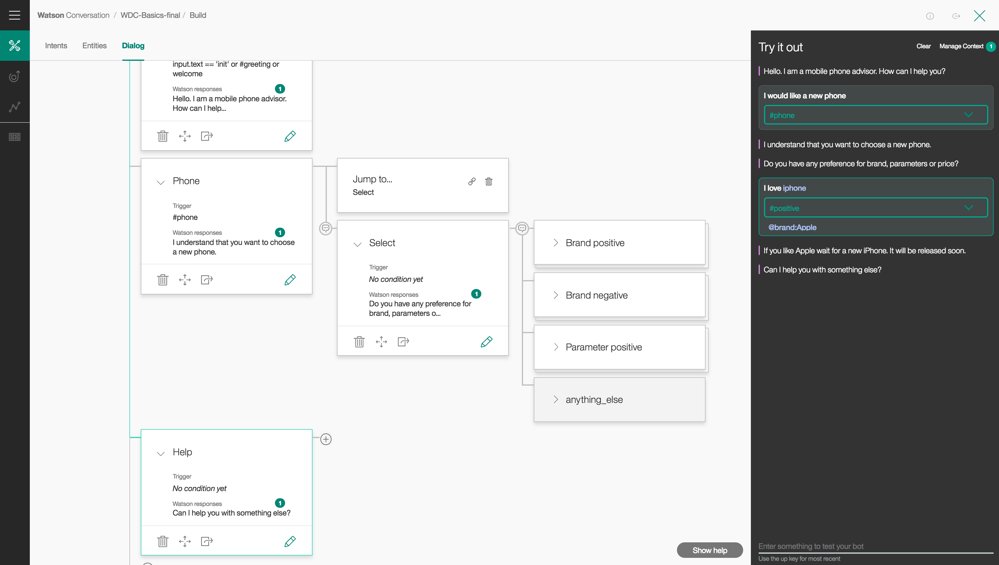
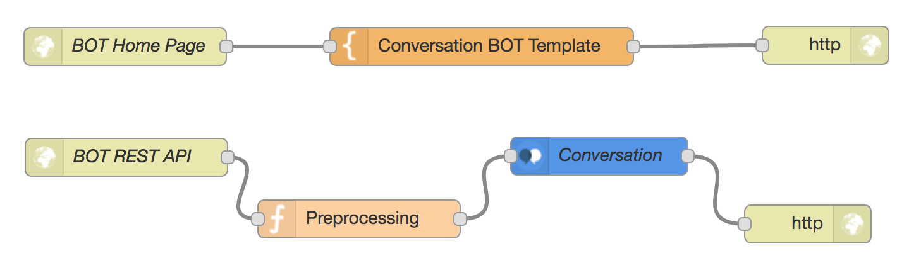
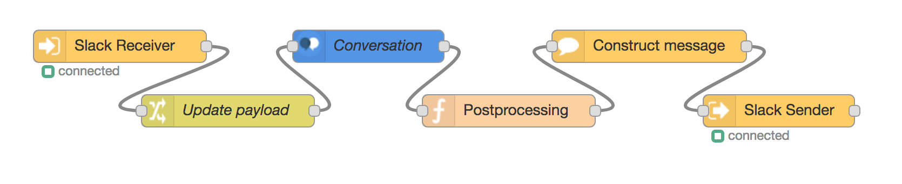
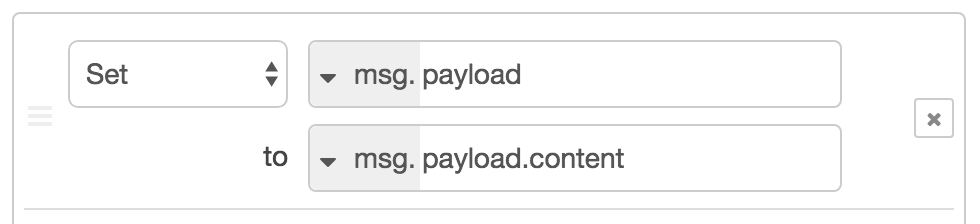
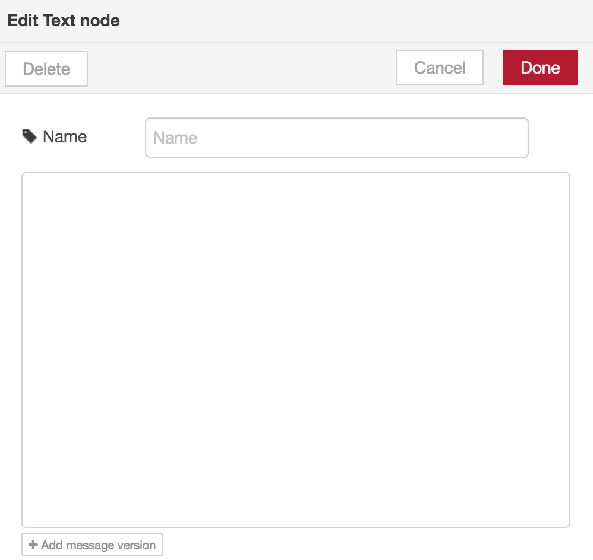

# Materials for WDC Basics
Web Chatbot Application utilizing Conversation API, connect to 3rd party chat service.

## Requirements
- Bluemix account
- Slack account

## Agenda 1st part:
- setup Conversation instance
- create intents, entities
- create dialog tree utilizing both intents and entities
- train classifier
- setup UI and orchestration app

## Agenda 2nd part:
- create Slack bot
- setup orchestration app and install Slack node
- create request and response routing to Conversation service

## Creating Conversation instance
In this section we are going to create [Conversation](https://www.ibm.com/watson/developercloud/conversation.html) with basic dialog structure to power our bot.
1. Log into Bluemix and create Conversation service
  - click on `Create Service`
  - search for and select `Conversation`
  - create the service with unique name
2. Launch tool by clicking on `Launch tool`
3. Create new `Workspace`
4. If you are not attending please look at [this tutorial](https://www.ibm.com/watson/developercloud/doc/conversation/tutorial.html) on how to create Intents, Entities, and Dialog
5. Create Intents:
  - #positive for expressing positive opinion about something
  - #negative for expressing negative opinion
  - #phone for expressing intent to get advice about a new phone
  - #greeting to capture greetings
6. Create Entities:
 - @brand with values Samsung, Apple and HTC (feel free to include more)
 - @parameter with values battery and style

7. Create Dialog tree that helps the user choose a mobile phone based on their preference
  - if you want, you can download the whole Workspace [here](./Conversation/basic-workspace.json)
  - you can import whole Workspace by clicking on  icon next to Create button in Workspaces
 
 
8. Test the Dialog inside the Conversation tool and make sure that you try all branches of the dialog tree

9. Finally, go back to the Workspaces, click on the three dots in the Workspace you created, View Details and copy and save Workspace ID

## Creating UI for the Conversation app using Node-RED
In this section we are going to create a UI for our chatbot using Node-RED.

If you are not attending please look at [this tutorial](https://github.com/watson-developer-cloud/node-red-labs/blob/master/introduction_to_node_red/README.md) to get started with Node-RED
1. Log into Bluemix and create Node-RED Boilerplate Application
  - click on `Create App`
  - search for and select `Node-RED Starter`
  - create new application with unique name
2. After creating the application head over to `Connections` tab and click on `Connect existing`
3. Select and connect Conversation instance we created. Restage the app.
4. After restaging, go to the app's URL and go through the initialization process.
5. Go to the Node-RED flow editor
6. We are going to create 2 components. One for displaying basic UI and another for communicating with the Conversation
7. In the first component, create:
  - `http in` node with method `GET` and URL `/`
  - `template` node with the content from [here](./Node-RED/template.html)
  - `http response` node
8. Connect them together as shown below
9. In the second component create:
 - `http in` node with method `POST` and URL `/botchat`
 - `function` node with the following code:
```javascript
msg.params = msg.params || {};
msg.params.context = msg.payload.context;
msg.payload = msg.payload.message;
return msg;
```
 - `Conversation` node with Workspace ID of your workspace
 - `http response` node
10. Connect them together, Deploy and go to you website's URL

11. From now on, you can access the Node RED editor at `your-website.mybluemix.net/red` and the deployed UI at `your-website.mybluemix.net/`
12. You can download and import the whole Flow [here](./Node-RED/basic-flow.json) but don't forget to update the Workspace ID
- note: Sometimes, `Text` node does not work after importing, try deleting it and recreating it (up to 5 times) if you are sure that problem is there
- use debug node to determine where the messages are not passing through
## Connecting Conversation with Slack
1. Go [here](https://ibm-fsa2017-eu.slack.com/apps/new/A0F7YS25R-bots) and choose a unique name for your bot
  - in general, you can create bot in any Slack team which you are a member of [here](https://my.slack.com/services/new/bot)
2. Save the API Token for later
3. Head over to Node-RED flow editor on your website
4. We will create a new Flow for the Slack chat that will be hosted on the same website
5. In the top-right menu select `Manage palette` and then `Install`
6. Search for and install `node-red-contrib-chatbot`
7. Create `Slack In`, `Change`, `Conversation`, `Function`, `Text`, and `Slack Out` nodes and connect them together

8. Configure `Slack In` node by clicking on the pencil and input Bot name and Token
9. Use the same Bot in `Slack Out`
10. In `Change` node set `msg.payload` to `msg.payload.content`. The type needs to be changed to `msg.` because the default is `string`.

11. Configure `Conversation` with Workspace ID you want to use and check `Save context`
12. Past this into the `Function` node:
```javascript
var output = msg.payload.output.text;
for (var t in output) {
    msg.payload = output[t];
    node.send(msg);
}
return ;
```
13. You need to configure the text node that constructs the message by removing its message field and leaving it empty as on the picture:

14. Go over to Slack and try to chat with your Bot
15. You can download and import the whole Flow [here](./Node-RED/slack-flow.json)
- note: Sometimes, `Text` node does not work after importing, try deleting it and recreating it (up to 5 times) if you are sure that problem is there
- use debug node to determine where the messages are not passing through
